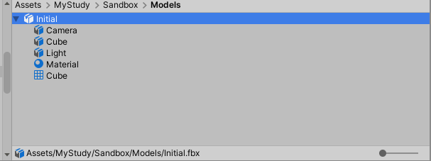
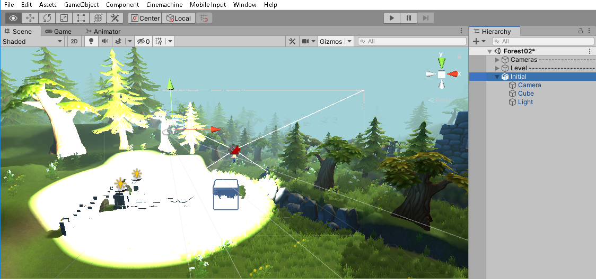
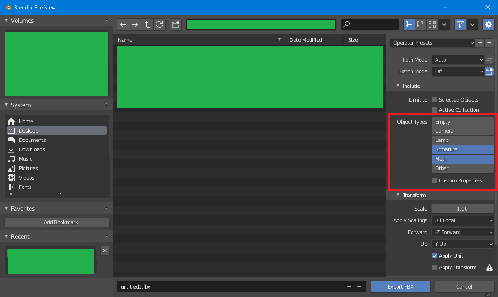
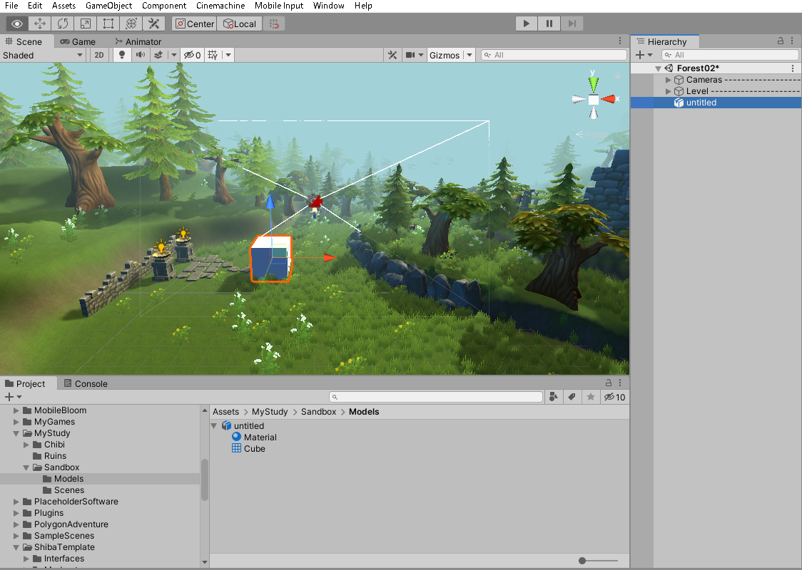

[3D技術の目次へ](./../)

### Blenderのファイル構造とfbxへの出力

とりあえずBlenderの初期状態をfbxに出力して読み込んでみましょう。

Blenderで「新規作成」を選ぶとこんな感じ。

この状態で「File」→「Export」→「Export」で書き出すと、fbxファイルができる。

このfbxファイルをUnityのプロジェクトビューにインポートすると、普通にインポートできる。

箱だけかと思ったらなんかカメラとライトがついてる……。

このfbxファイルをSceneビューに配置するとこんな感じ。

めっちゃまぶしい……。

LightにはLightコンポーネントが、CameraにはCameraコンポーネントがくっついている。

これはまずいですね……Blenderは初期状態でついてるカメラやライトもfbxに書き出してしまうし、
Unityもそれを読み込めてしまう（しかもめっちゃまぶしい）……。

むむ、fbxのエクスポート設定のところに何やらランプやカメラを除去して書き出してくれそうな設定が。

これで読み込むと眩しくなくなりました……。

以上から、

- Blenderからfbxの出力でとりあえずUnityに持ってこれる
- カメラやランプはエクスポート設定で除外できる
- Blender上ではカメラやランプもBoxと同じようにオブジェクト的なものとして扱われている

ということが分かりました。

実は回転とかおかしいけど、それはひとまず後で。
