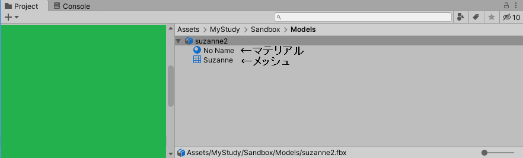

[3D技術の目次へ](./../)

### マテリアル未設定の「スザンヌ」をUnityに持っていく

#### とりあえず何も考えずにUnityに持っていってみる

初期状態から、箱を消して、「Add」→「Mesh」→「Monkey」すると、スザンヌが出現しました。

これをさっきと同じようにライトとカメラを除いてエクスポートして、Unityへ。

ん。とりあえず配置できた。

けど……後ろ向いちゃってるな。なんかRotationが-89.98とかなってるし。

あと、なんかBlenderで見た時よりテカってるような。

Rotationを0にすると……

分かりにくいけど、下を向いてしまった。

あとScaleも100だな。これを通常の1.0にすると……まぁ米粒みたいなサイズになるよね。（省略）

なんか回転とスケールがよくない。

#### 回転とスケールを何とかする

結論から言うと、これはBlenderの設定で何とかなる。

改めてよく見ると、スザンヌはBlender上ではY軸の負の方向を向いている。

そして、Unity上でも、Rotationを0にすると下方向、つまりY軸の負の方向を向いていた。UnityとBlenderでは画面に対する軸の取り方が違うけどモデルの軸は変わっていないということだな。

BlenderではY軸マイナス方向が正っぽいけど、Unityでは、通常、Z軸の正方向が正となる。

さらに、Z軸を中指、Y軸を人差し指、X軸を親指となるようにすると、
Blenderでは右手、Unityでは左手になる。

画面上の軸の取り方も違うし、座標の「左手系」「右手系」も違う。

まあ違うのは分かったけど結局どうすればいいのかと言うと、エクスポート設定をこうすればよい。

- Scaleを「1.00」にしてApply Scalingsを「FBX All」にする
- Forwardを「-Z」、Upを「+Y」つまりUnityの設定に合わせる
- Apply UnitとApply Transformationのどっちにもチェックをつける

すると、ちゃんとZ軸の奥を向くし、回転もないし、スケールも1になる。ハッピー！

……当面そんなに困ることはなさそうだけど、実はこの「Apply Transformation」は実験的機能で、
オブジェクトを階層構造にしすぎたりするとうまく動作してくれないらしい。

奥の手としてはモデル全体を回転させて、Z軸正方向に向かせて、さらに左右反転させること。めんどくさそう。
とりあえず困るまではエクスポート設定で対応しよう。

#### ちゃんと読み込めたSuzanneを見てみる

Projectビュー上で読み込んだSuzanneを確認すると、「マテリアル」と「メッシュ」が中に入っているような感じになっている。

また、fbxファイル自体にカーソルを合わせてInspectorビューを表示させると、「import settings」という項目が表示され、「Model」「Rig」「Animation」「Materials」と設定項目がタブに分かれていっぱいある。

人型を読み込むときはここで人型の設定をするが、ここでは無視する。

また、Hierachy上に配置したSuzanneにカーソルを合わせてInspectorビューを表示させると、「Mesh Renderer」と「Mesh Filter」のコンポーネントがある。

Mesh Filterには先ほどProjectビュー上で見た「メッシュ」が、Mesh Rendererには、マテリアルとしてProjectビュー上で見た「マテリアル」が適用されている。

さらに、Suzanneの内部に含まれているMaterialを見てみると、編集できないが、「Shader」が「Standard」となっている。

これはUnity標準のStandard Shaderで、SuzanneはBlender上ではマテリアル未設定だが、Unityに持ってくるとStandard Shaderが適用されたマテリアルが作られ、自動で割り当てられる。

さて、この「Standard Shaderが適用されたマテリアル」について、マテリアルは通常、拡張子がmatのファイルだが（例えばProjectビュー上で「Create」→「Material」を選択すると生成できる）、Suzanneのfbxファイルの入ったフォルダを開くとこのマテリアルは確認できない。

実は、そのあたりはmetaファイル内に書かれており、Unity上で扱える仮想のマテリアルのようになっている。

この「ファイルとしては存在しないがUnity上で仮想的に扱えるもの」は、Projectビュー上で選択して「Ctrl+D」で
実ファイルとして切り出せるようになっている。あまり情報として出てこないが、よく使う。

Suzanne.fbxから仮想的に生成されたメッシュとマテリアルをそれぞれ「Ctrl+D」で切り出すと、Projectビュー上でこのように表示され……。

フォルダ上にもちゃんと存在する。なお、元のファイルには影響を与えない。

さらに、空のGameObjectにMesh FilterとMesh Rendererをアタッチして切り出したメッシュとマテリアルを当てはめると、ちゃんとSuzanneになる。

つまり、この「仮想的なもの」（以下、仮想アセット）は編集できないだけで普通のマテリアルやメッシュと同じで、また切り出すことで独立したものとして扱うことができるということ。

Suzanneはアニメーションを持たないが、実はアニメーションもfbxを読み込むと仮想アセットとして読み込まれ、それを切り出して他の人型モデルに適用することでアニメーションを使いまわすことができる。

そのあたりはのちのちやってみよう。

