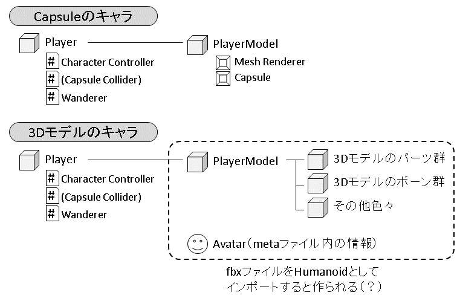

# とりあえずキャラクターで3D空間を動けるようにする - 人型アニメーション

[戻る](./../index.md)

## 3Dキャラを動かしたい

3D空間を移動できるようになったけど、カプセルじゃやっぱりテンションが上がらない。
どうせなら3Dキャラを動かしたい。

……でも、アニメーション付きのキャラっぽいアセットを買ったけど、デモシーン以外で動かす方法が分からない。

ここでは、先ほど作った、カプセルの当たり判定を持ち、CharacterControllerを使って移動できるようにした
キャラクター（カプセル）を、キャラクター（3Dキャラ）に変える方法を説明します。

基本的に、カプセルを表示していたのを、3Dキャラに差し替えただけで、
CharacterControllerについての処理は何も変わらないと考えてもらえばよい。

具体的には、こういうGameObjectの親子関係になる。

実際に表示されるものをPlayerModel、表示とは関係なくプレイヤーの動作を制御するものをPlayerと呼ぶ。Playerの上にPlayerModelが乗っており、PlayerModelの構造は、3Dモデルの場合非常に複雑である。

（PlayerとPlayerModelという呼び方はTopdownEngineの呼び方を引用している）

## Unityの人型アニメーションを構成するもの

Unityの人型アニメーションは、以下のような要素からなっている。

- 人型モデル（.fbxファイル）
- AnimationClip（.animファイル）
- AnimationController（.Controllerファイル）
- Animatorコンポーネント（コンポーネント）
- Avatar（.fbxファイルのmetaファイルの中に含まれる設定）

