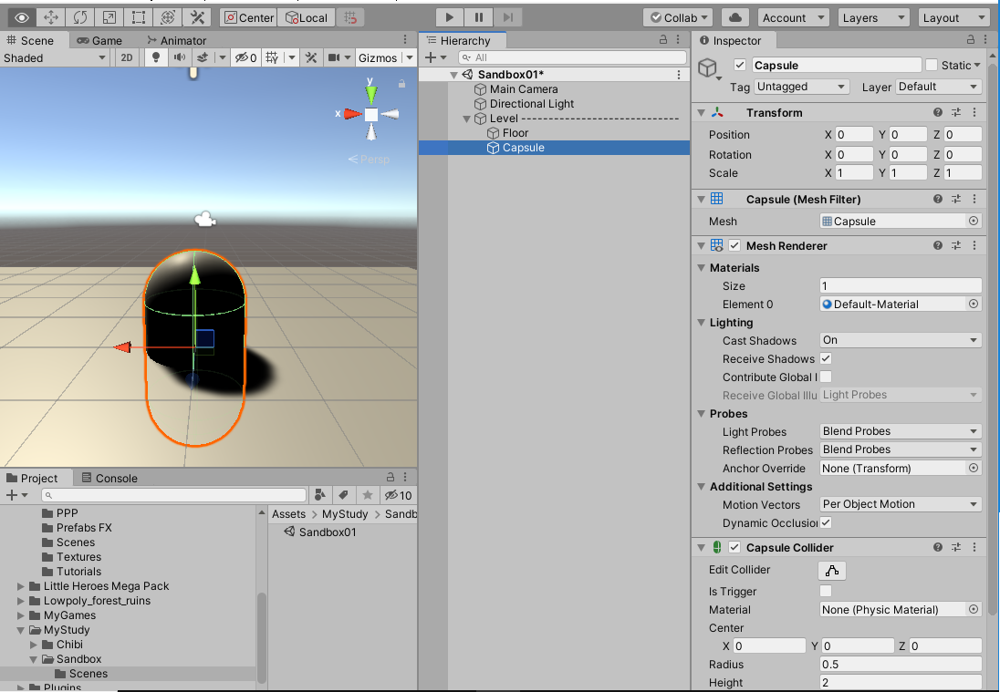
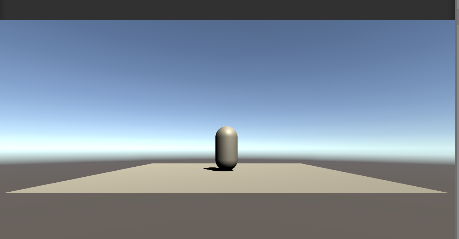
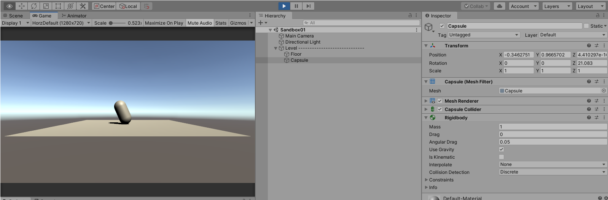
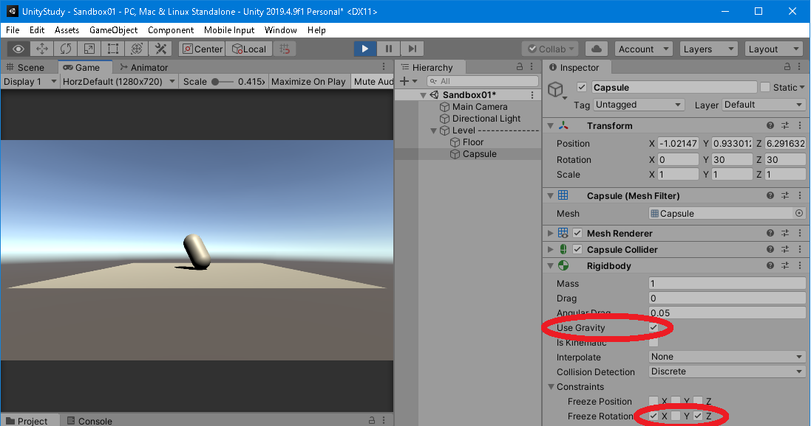
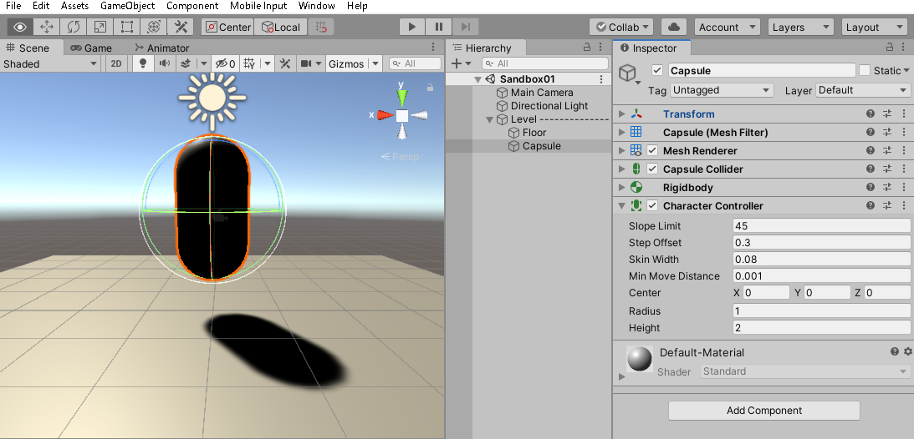

# とりあえずキャラクターで3D空間を動けるようにする

[戻る](./../index.md)

## とりあえず

ほんとはプログラミングじゃんじゃんやりたいけど、Cubeとかがちょっと動くだけだったりするのって
いまいちテンション上がらない。

やっぱりUnityと言えば3Dアクションに最適化されてる感じもあるし、サードパーティのアセット内の
空間をキャラクターが動くだけでも結構テンション上がるので、
とりあえず3D空間をキャラクターが動けるようにしたい。

……という方針になるまで、大分かかりました。

これでうまくいくか分かりませんが、ひとまずこの方針で行きます。

## 何があればいいのか？

- ステージ
- キャラクター
- 入力を受け付ける機構

……って感じ？

ここではCharacter ControllerというUnity標準の便利スクリプトを使って動かすことを考えます。

Character Controllerは、斜面とか壁とかとの衝突をなんかうまい感じにやってくれるやつです。

Character Controller以外にも、RigidbodyにAddForceする方法とかいくつか方法はありますが、
ひとまずシンプルな方法で、あくまで現時点では3D空間をキャラが動いてテンションを上げることが目的なので。

## 準備

それぞれいくつか方法があります。

### ステージを準備する方法

やっぱおすすめはかっこいいなって思うアセットストアのステージを使うことかなって。

#### おすすめじゃないけど早い

Levelというダミーオブジェクトを作り、それを右クリックして「3D Object」→「Plane」と選択して、床を作る。

名前をFloorに変更する。

Mesh Colliderがつくのがポイント。コライダーは衝突判定に使うコンポーネントで、
コンポーネントを削除するとキャラクターがすり抜けてしまう。

#### おすすめ

何でもいいけど、すり抜ける時はまずコライダーがちゃんとついてるか確認しましょう。
大体ついてるけど、小物とかはついてなかったり、逆にざっくり直方体でついてたりする。

#### 今後のために

ステージはLevelというダミーGameObjectを作ってその子として全部配置すると良い。

### キャラクターを準備する方法

これもお気に入りのアセットを使ってみたいっすねぇ。

……と言いつつ、キャラクターはモデルデータだけでどうやって配置していいか分からなかったりするので、
ひとまず以下のいずれかの方法で試すのをおすすめ。

#### テンションは上がらないが一番つまづきにくい

長いですが、ひとまず一番丁寧に。

さっき作ったLevel又は準備したステージの親オブジェクトを右クリックし、

「3D Object」→「Capsule」。

床にめり込む（でかい）カプセルが出現する。

とりあえずTransformのPositionのYを1にして床から引っ張り上げる。

再生。

動かない。

重力とか与えてないんで……。

「Add Component」→「Rigidbody」追加。ついでに、Transform.Rotation.Zを1にしてちょっと傾ける。

再び再生。

おっ、なんかゆっくり倒れた。いい感じ。

これは床とちゃんと衝突するかのテストでした。Colliderは衝突を、Rigidbodyは力学的な挙動を担当しています。

じゃあ衝突するだけならRigidbodyは要らないのかと言えば、Colliderだけでも衝突は判定してくれますが、
衝突した後の挙動が計算されないので、動作としてはすり抜けてしまい結局よく分からない結果に。

マス目で動かすゲームとかだとRigidbodyは不要でColliderだけでの判定をすることもありますが、
ここでは「とりあえず3D空間を動かす」が目的なので、Rigidbodyを使いましょう。

落下速度が気に食わなければ、「Edit」→「Project Settings」→「Physics」のGravityを変更すれば変更できます。

Rigidbodyの設定を少しいじって、ConstraintsのFreeze RotationのX, Zにチェックをつけると、倒れなくなります。

これでキャラクター（ここではカプセル）が床につまづいたり、天井などに顔面強打しても傾かなくなります。

また、Use Gravityはひとまずチェックを入れておきましょう。

試しに、Rotationに適当な値を入れて再生するとこんな感じ。

さっきと絵面は似ていますが、傾いても倒れません。

地面を傾けたりして挙動を確認してみましょう。

気が済んだら床は平らに戻して、カプセルのTransform.Rotation.Zも0に戻しましょう。
このカプセルがキャラクターとなります。

#### テンションが上がるいくつかの方法

### キャラクターを動かす

「Add Component」で検索窓に「Character Controller」と入れて出てきたものをアタッチする。

