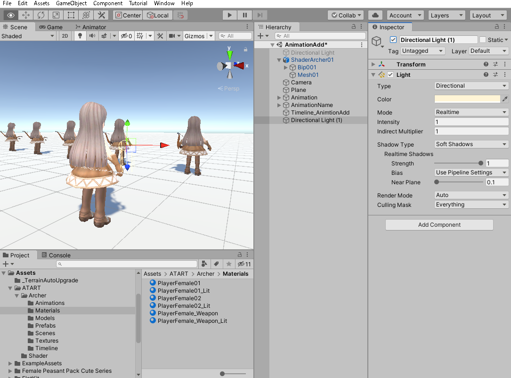
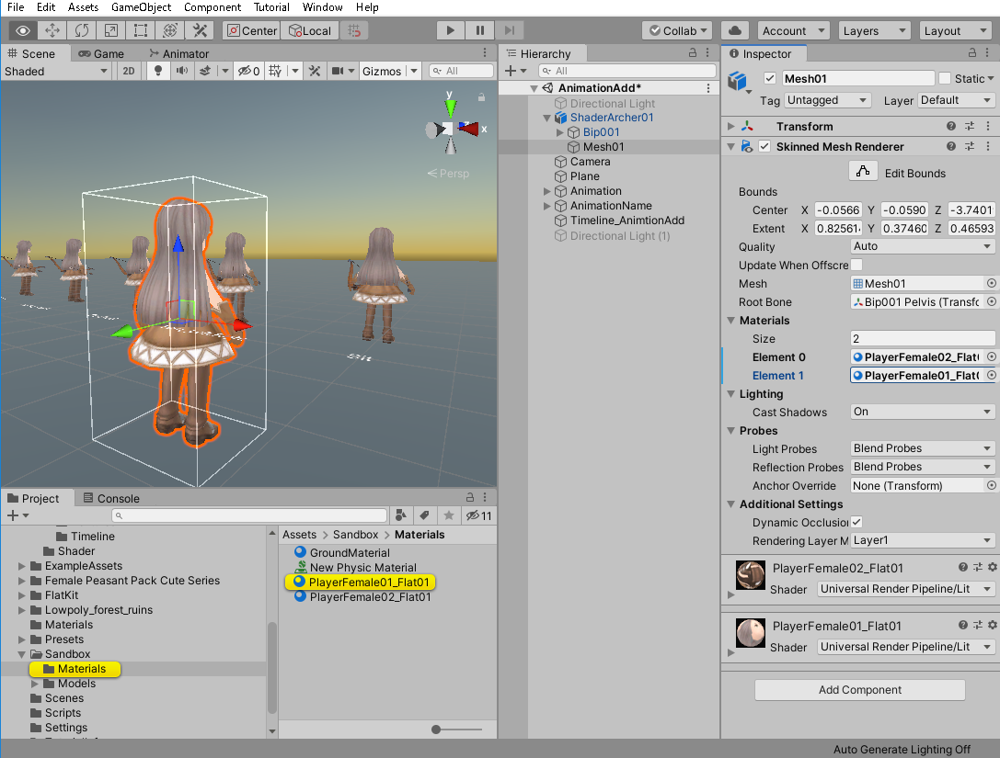
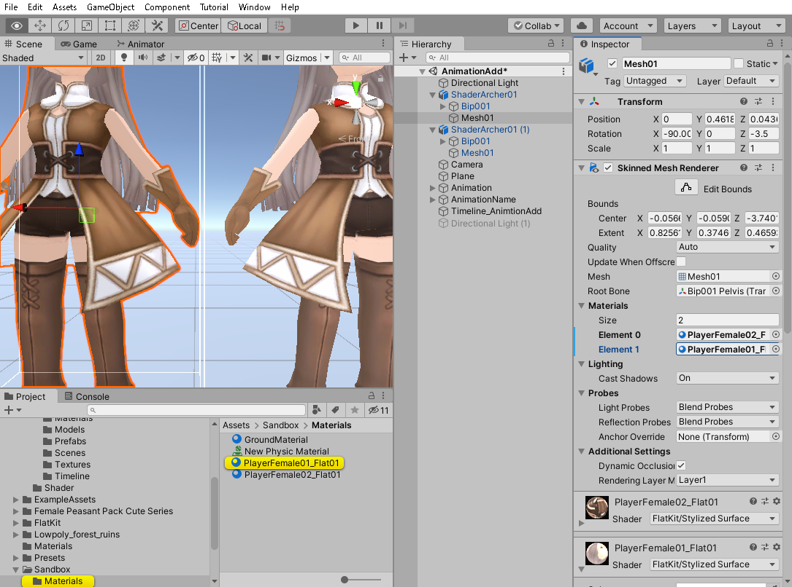
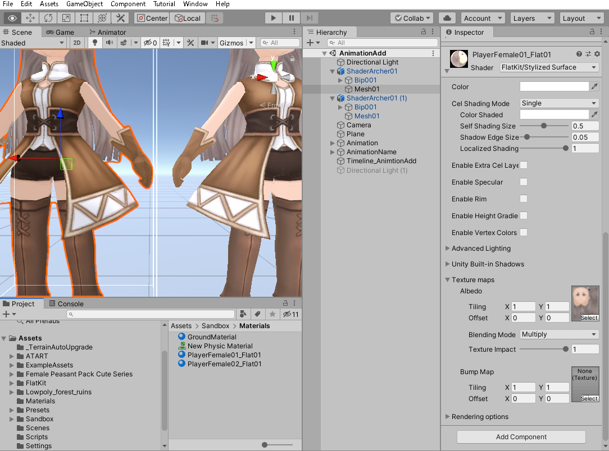

[Unity - グラフィックの目次へ](./../index.md)

# 既存モデルのシェーダを変更して遊んでみる

## マテリアルの複製・シェーダの変更

前の項では、fbxファイルをシーンに配置すると、fbxファイルそのものではなく、fbxファイルを元に作られた
GameObjectが配置されることを確認した。

続いて、配置したArcherのマテリアルを変更してみよう。
fbxの状態ではマテリアルは編集できないが、配置したGameObjectのマテリアルであれば変更できる。

ここではArcherにはPlayerFemale01とPlayerFemale02というマテリアルが割り当てられている。

これはライティングを考慮しない（と思われる）マテリアルだが、これをライティングを考慮するマテリアルである
PlayerFemale01_LitとPlayerFemale02_Litにそれぞれ差し替えてみる。

すると、ちょっと見た目が変わった。まっピンクになった場合は、マテリアルに、URPに対応していないビルトインシェーダが割り当てられていると思われるので、シェーダをURP/Litに変更するなどして対応する。

試しに、シーン上のDirectional Lightを無効にしてみると、URP/Litのマテリアルを割り当てたArcherのみが光の影響を受けて色が変わる。

続いて、別のシェーダを試してみる。設定されているマテリアルのShaderを変更するとそのマテリアルが変更されてしまうので、マテリアルを複製してからシェーダを変更する。ここではFlat Kitのシェーダを使うため、PlayerFemale01_Flat01という名前にする。（まだshaderはURP/Litのまま）

そして、それぞれのマテリアルをFlat Kit/Stylized Surfaceにする。

元々テクスチャに陰影がついているので分かりづらいが、右がURP/Litのシェーダ、左がFlat kit/Stylized Surfaceのシェーダを割り当てたArcher。左の方は、腕や手袋の影がくっきりしているのが分かる。

## シェーダのパラメータ

ところで、シェーダにはそれぞれパラメータがある。

Flat Kit/Stylized Surfaceはテクスチャを「Texture Maps」→「Albedo」の位置に入れる。
（URP/Litから切り替えると自動的に入るようになっている）

シェーダによる表現を使いこなすには、シェーダのマニュアルを読むなどして
各パラメータの意味を理解しなければならない。

