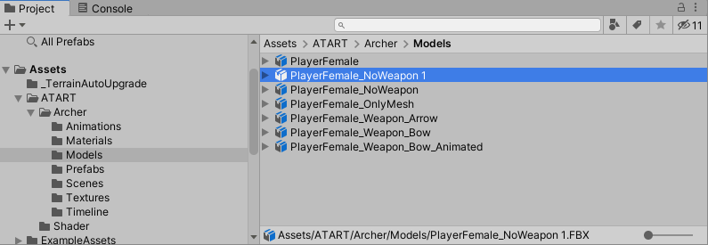

[Unity - グラフィックの目次へ](./../index.md)

### 既存モデルのシェーダを変更して遊んでみる

自分の作りたい「画」を探すために色んなシェーダを試したい。
そして、折角なら単純なモデルでなくヒューマノイドとかを実験台にしたい。

そこで、ここでは以下の条件で既存モデルのシェーダを変更して遊んでみる方法について記す。

- 既存モデルはfbxファイルで提供され、デフォルトで「URP/Lit」シェーダが使用されているものとする。
- 既存モデルのオリジナルデータは変更しない。
- 既存モデルを使用したデモシーンがある。

ここでは、デフォルメの入った3Dキャラである「ATART Archer」を例に説明する。

#### fbxファイルを複製してシェーダを差し替える

##### ファイルの複製

オリジナルデータを変更せずにシェーダを差し替えるということで、
まずはfbxファイルをそのまま複製する。

Projectビュー上でファイル（ここではfbxファイル）を選んでCtrl+Dキーを押すと、ファイルを複製できる。

これはfbxファイル以外にも使用できる。

複製したファイルは好き勝手してもいいように別フォルダに移しておく。
ここではSandbox/Models/Duplicatedフォルダに入れ、ファイル名をShaderArcher01に変更した。

##### fbxファイルの中身を見る

複製したfbxファイルの中身を見ると、

「Bip001」「Mesh01（箱アイコン）」「Mesh01（格子アイコン）」「ShaderArcher01Avatar」という4つのものがfbxファイルに内包されている（アセットの内包については別ページ（作成中）を参照）。
これらは、

- Bip001→キャラの骨格を表すためのGameObjectのツリー
- Mesh01（箱アイコン）→メッシュ情報を表示させるための「Skinned Mesh Renderer」がアタッチされたGameObject
- Mesh01（格子アイコン）→メッシュ情報
- ShaderArcher01Avatar→このモデルをHumanoidとして解釈するための情報が入ったもの

であり、モデルによって名前は違うが、3Dモデルはこれに類似のものを内包していることが多い。

（マテリアルも内包している場合も多い。それについては後述）

##### シェーダを変更する

このうち、シェーダの変更にかかわる部分は「Mesh01(箱アイコン）」である。

Mesh01（箱）にアタッチされているSkinned Mesh Rendererには2つのマテリアルが設定されている。

マテリアルはInspector上でプレビュー表示されている。

マテリアルをクリックすると確認できるが、このマテリアルはfbxファイルとは独立して存在するファイルである。

「Standard」シェーダなどのビルトインシェーダ（Unityに最初から提供されているシェーダ）は、一部はUnityに変換機能がついている。

「Edit」→「Render Pipeline」→「Universal Rendering Pipeline」→「Upgrade Project Materials To UniversalRP Materials」

を実行すると、プロジェクト内のマテリアルにセットされている、変換に対応しているビルトインシェーダを一括してURPの対応するものに変換できる。

よく使われているビルトインシェーダの対応状況の例は以下の通り。

「Standard」→「Universal Rendering Pipeline/Lit」
: 実際の物理法則に則った3D物体に使用される。

