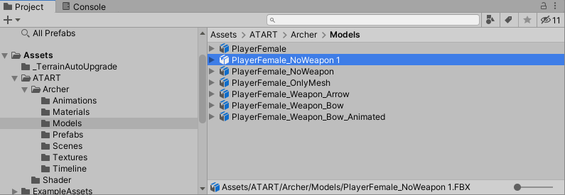
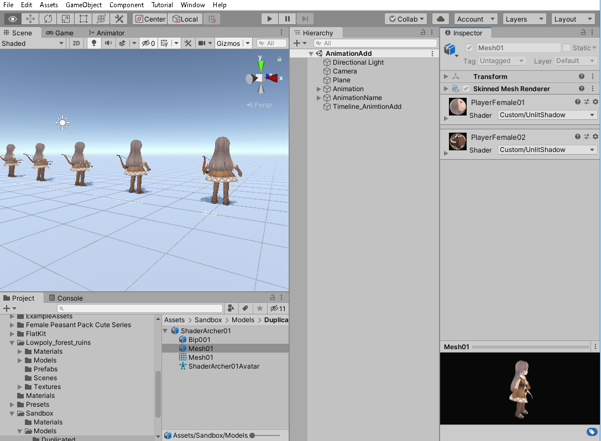
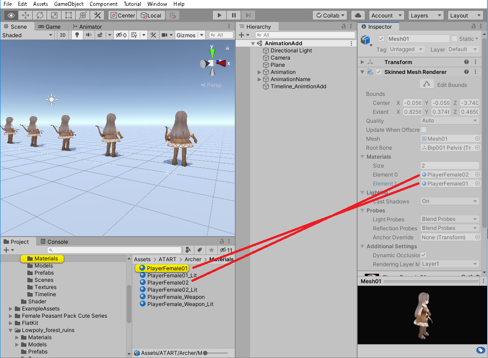
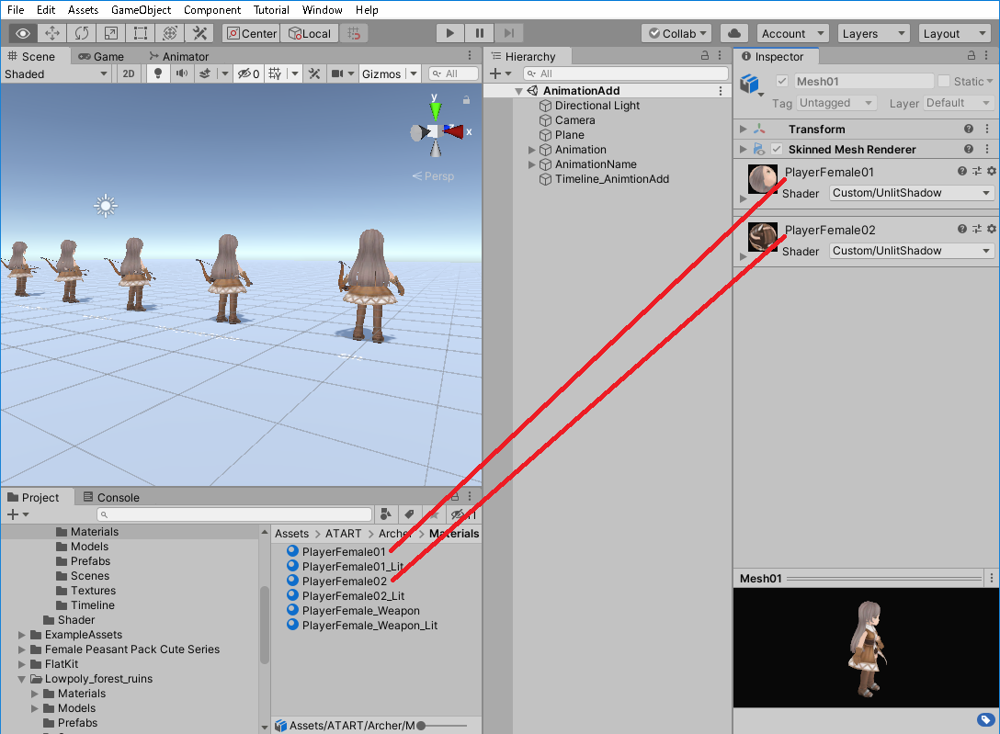
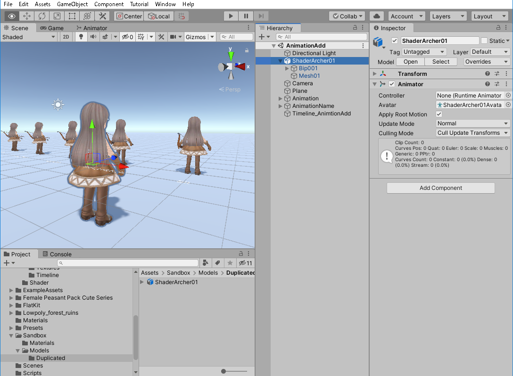
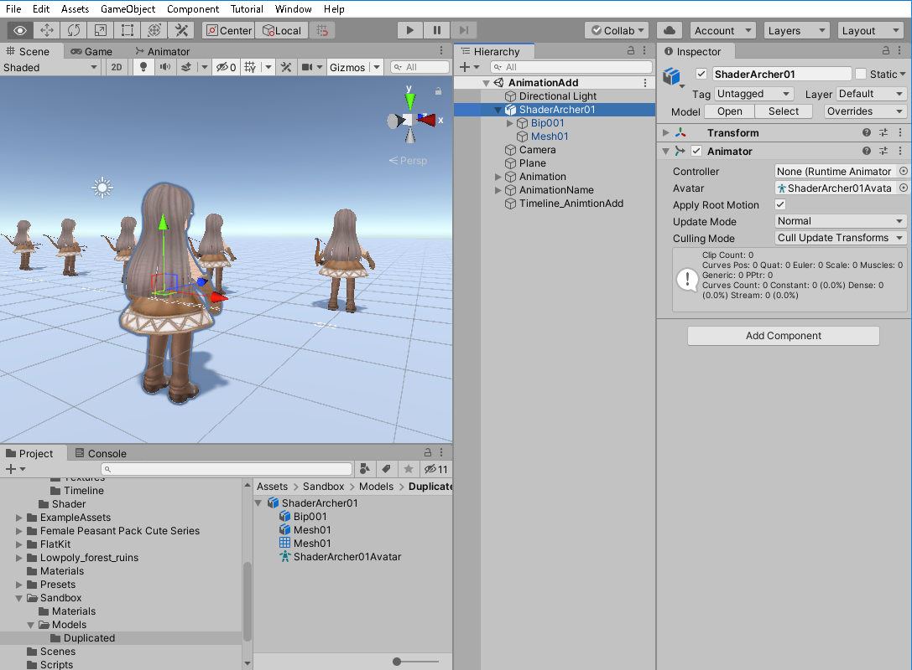
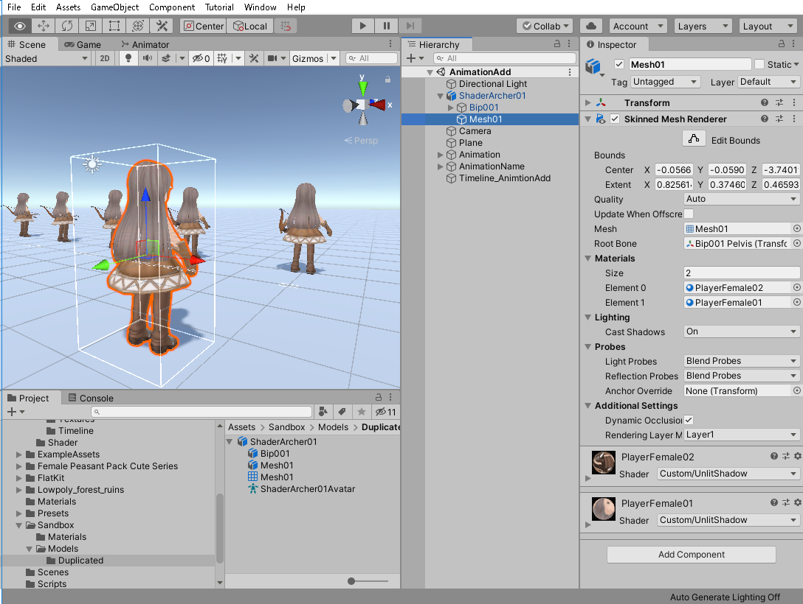

[Unity - グラフィックの目次へ](./../index.md)

# fbxファイルをシーン上に配置した時の挙動

自分の作りたい「画」を探すために色んなシェーダを試したい。
そして、折角なら単純なモデルでなくヒューマノイドとかを実験台にしたい。

そこで、ここと次の項で、以下の条件で既存モデルのシェーダを変更して遊んでみる方法について記す。

- 既存モデルはfbxファイルで提供され、デフォルトで「URP/Lit」シェーダが使用されているものとする。
- 既存モデルのオリジナルデータは変更しない。
- 既存モデルを使用したデモシーンがある。

ここでは、デフォルメの入った3Dキャラである「ATART Archer」を例に説明する。

## fbxファイルを複製してシェーダを差し替える

### ファイルの複製

オリジナルデータを変更せずにシェーダを差し替えるということで、
まずはfbxファイルをそのまま複製する。

Projectビュー上でファイル（ここではfbxファイル）を選んでCtrl+Dキーを押すと、ファイルを複製できる。

これはfbxファイル以外にも使用できる。

複製したファイルは好き勝手してもいいように別フォルダに移しておく。
ここではSandbox/Models/Duplicatedフォルダに入れ、ファイル名をShaderArcher01に変更した。

### fbxファイルの中身を見る

複製したfbxファイルの中身を見ると、

「Bip001」「Mesh01（箱アイコン）」「Mesh01（格子アイコン）」「ShaderArcher01Avatar」という4つのものがfbxファイルに内包されている（アセットの内包については別ページ（作成中）を参照）。
これらは、

- Bip001→キャラの骨格を表すためのGameObjectのツリー
- Mesh01（箱アイコン）→メッシュ情報を表示させるための「Skinned Mesh Renderer」がアタッチされたGameObject
- Mesh01（格子アイコン）→メッシュ情報
- ShaderArcher01Avatar→このモデルをHumanoidとして解釈するための情報が入ったもの

であり、モデルによって名前は違うが、3Dモデルはこれに類似のものを内包していることが多い。

（マテリアルも内包している場合も多い。それについては後述）

このうち、シェーダの変更にかかわる部分は「Mesh01(箱アイコン）」である。

Mesh01（箱）にアタッチされているSkinned Mesh Rendererには2つのマテリアルが設定されている。

マテリアルはInspector上でプレビュー表示されている。

マテリアルをクリックすると確認できるが、このマテリアルはfbxファイルとは独立して存在するファイルである。

Inspectorのプレビュー表示上でマテリアルのシェーダを差し替えることが出来るが、
そうするとマテリアルのオリジナルデータを編集してしまうことになる。

よって方針としては「マテリアルもオリジナルを複製したものを作り、そのマテリアルを割り当てたい」のだが、上の画像から分かる通り、fbxファイルに割り当てられたマテリアルは変更できない（グレー表示）。

### fbxファイルをシーン上に配置した時の動作

では、fbxファイルをシーン上に配置するとどうなるか。

これはfbxファイルをシーン上にD&Dで配置した時の状態である。

一見fbxファイルがそのまま配置されたようにも見えるが、実際はそうではない。

- ルートのオブジェクトはAnimatorが付与されたGameObjectであり、fbxファイルではない。
- AvatarとMesh（格子アイコン）は無くなっている。
- Avatarがどこに行ったかというと、Animatorの「Avatar」の欄に割り当てられている。
- Mesh（格子アイコン）がどこに行ったかというと、Mesh01のSkinned Mesh Rendererの「Mesh」に割り当てられている。

理解すべきことは、fbxファイルをシーン上に配置した場合、それはfbxファイルそのままではなく、fbxファイルを元にその要素からコンポーネントを作成したGameObjectだということである。

つまり、例えば、fbxファイルの要素を一部差し替えたい場合、fbxファイルを配置してからそのGameObjectの構成要素を差し替えるか、fbxファイルをD&Dした時と類似になるようにGameObjectを作ればよい。

