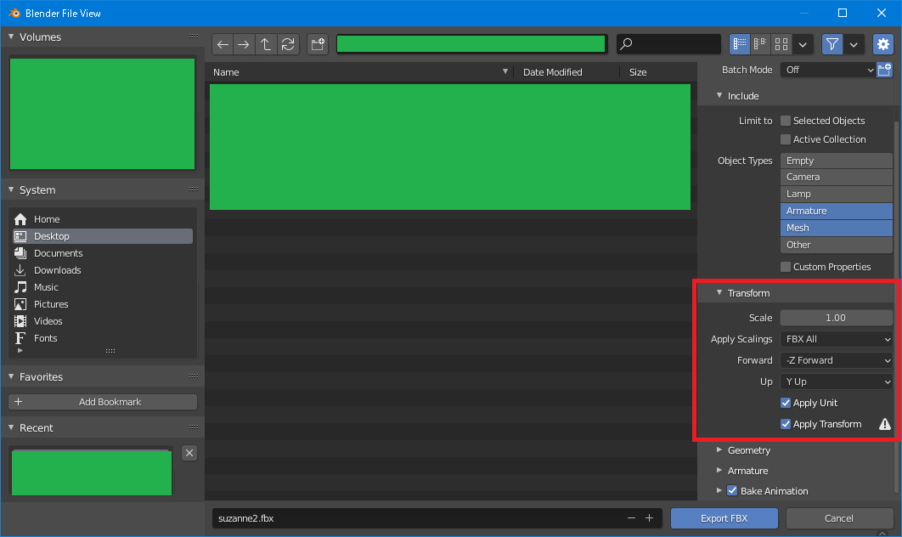
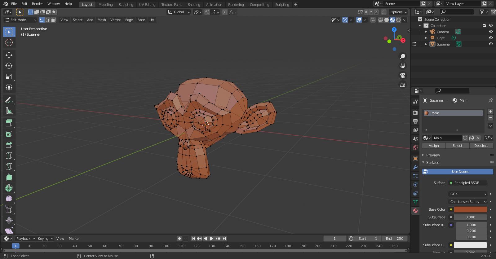
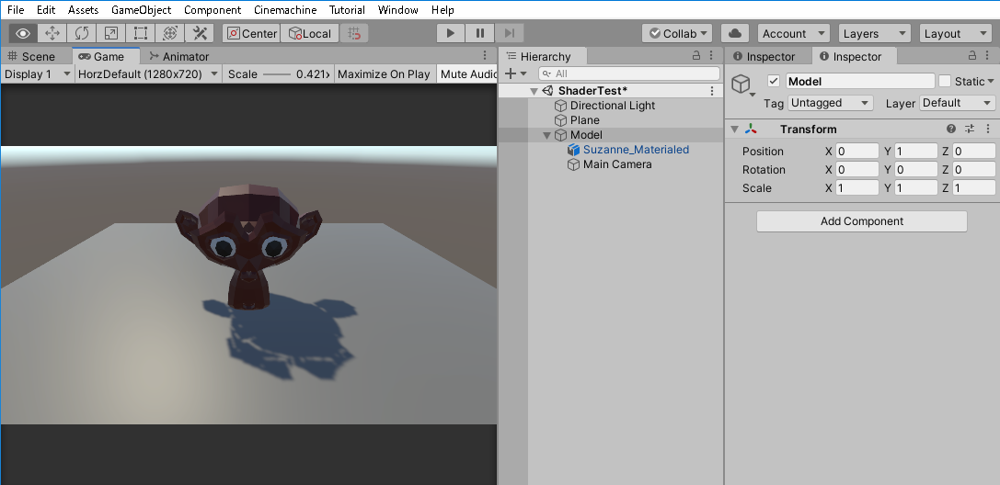

# Shade FlatとShade Smooth

## Suzanneの準備

### はじめに

「自作シェーダ」の項では、Blenderの組み込みモデルである「Suzanne」を使用する。

まず、Blender上でSuzanneを配置し、それをUnity用にエクスポートする流れを略式で説明する。

Blenderのバージョンは2.91。

### Suzanneの出現と書き出しテスト

「New File」→「General」で新規ファイルを作成。

まず、カメラ・箱（Cube）・ライトが存在する状態になるので、Collectionから「Cube」を削除。

「Add」→「Mesh」→「Monkey」とすると、「Suzanne」という名前のメッシュが出現する。

「File」→「Export」→「FBX (.fbx)」を選択。

この時、エクスポート設定を以下の通り設定する。

- Export対象を「Mesh」のみにする。
- Scaleを「1.00」にしてApply Scalingsを「FBX All」にする
- Forwardを「-Z」、Upを「+Y」つまりUnityの設定に合わせる
- Apply UnitとApply Transformationのどっちにもチェックをつける

これでSuzanneが出現することを一旦確認する。

### マテリアル設定

マテリアル（〇にクッキー模様）のプロパティから「New」でマテリアルを追加する。

マテリアル名は「Main」とし、Surfaceを「Principled BSDF」、Base Colorを茶色にする。

メッシュを選択し「A」で全選択、マテリアルプロパティから「Assign」を選択してマテリアルを割り当てる。

マテリアルの割り当てを確認したい場合は「Material Preview」を選択する必要がある。

同様にマテリアル「WhiteEye」「Eye」を作成し、それぞれ白目と瞳に割り当てる。

これを同様の方法でエクスポートし、Unity上に配置してみる。

### シーン上への配置

新規Sceneを作成し、Position(0, 0, 0)にPlaneを作成、Create EmptyでPosition(0, 1.00, 0)に空オブジェクト「Model」を作成。

SuzanneをPosition(0, 1.0, 0)に配置し、「Model」の子とする。

Main Cameraも「Model」の子とし、Main CameraはPosition(0, 1.5, 4)、Rotation(30, 180, 0)とする。

こんな感じになればOK。

## 目次

この目次内の記事は順番に読むことを推奨。

